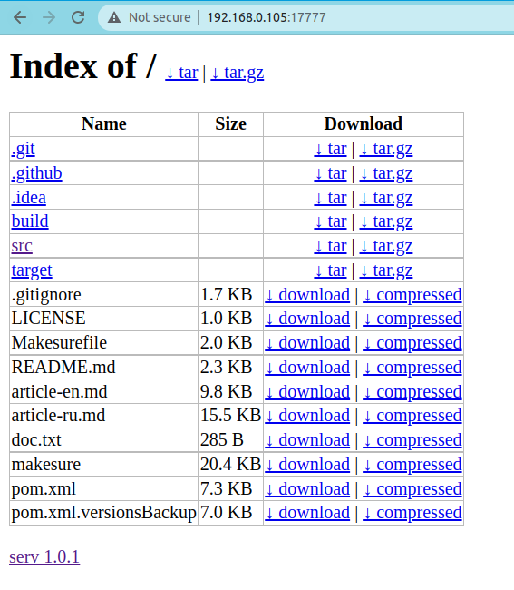

# serv


The simple tool to quickly share file or folder in local network.

After running the tool it gives you the precise commands that you can pass to your teammate to receive the file(s).

The tool also renders simple static server web-UI:



## Usage

Sharing a file:
```bash
$ serv '/path/to/report.pdf' 
To download the file please use one of the commands below: 

curl http://192.168.0.179:17777/dl > 'report.pdf'
wget -O- http://192.168.0.179:17777/dl > 'report.pdf'
curl http://192.168.0.179:17777/dl?z --compressed > 'report.pdf'
wget -O- http://192.168.0.179:17777/dl?z | gunzip > 'report.pdf'
```

Sharing a folder (all the files in it):
```bash
$ serv '/path/to/folder' 
To download the files please use one of the commands below. 
NB! All files will be placed into current folder!

curl http://192.168.0.179:17777/dl | tar -xvf -
wget -O- http://192.168.0.179:17777/dl | tar -xvf -
curl http://192.168.0.179:17777/dl?z | tar -xzvf -
wget -O- http://192.168.0.179:17777/dl?z | tar -xzvf -

Files listing: http://192.168.0.179:17777/
```

Help message:
```
$ serv -h
serv ver. 1.0.0
usage: serv [...options] <file or folder> [...<file or folder>]
 -H,--host <arg>    host to serve on (default is determined automatically)
 -h,--help          print help and exit
    --include-vcs   include VCS files (default = false)
 -p,--port <arg>    port to serve on (default = 17777)
 -v,--version       print version and exit
```

*Yes! All that simple!*

## Install

Sorry, but only Linux x64 is supported at the moment. Hopefully this will improve.

To install or update the tool simply run the command below.

```
$ sudo bash -e -c "
wget https://github.com/xonixx/serv/releases/download/v1.0.0/serv-linux-amd64 -O/usr/local/bin/serv
chmod +x /usr/local/bin/serv
echo \"serv \$(serv -v) installed successfully\" 
"
```

Also since the tool is written in Java (and compiled to executable via [GraalVM](https://github.com/oracle/graal) AOT compiler) 
it can also be run in any environment with Java 8 or above as traditional Java app.

## Dev notes

Captured a tag with last commit where favicon was done via embedding bytes in Java code: [favicon-via-bytes-in-java](https://github.com/xonixx/serv/tree/favicon-via-bytes-in-java). This was necessary since this was the most reliable way to serve resources in Graal at time.